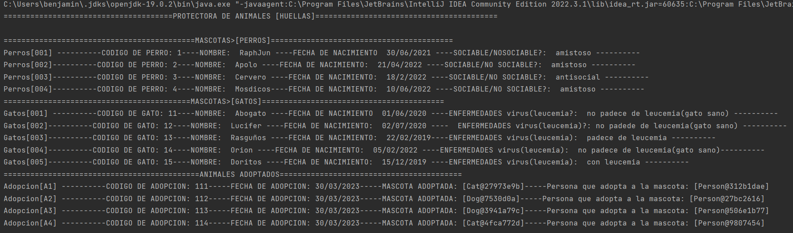
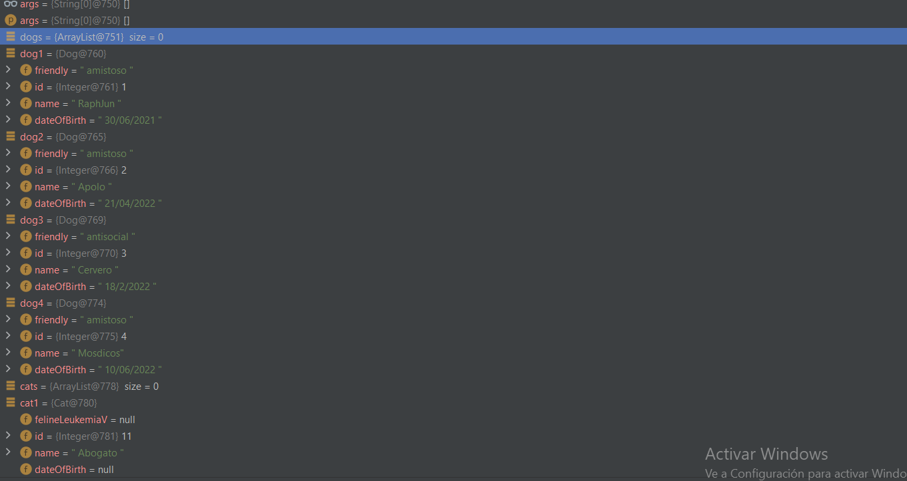

## Description de la tarea

<!-- Desarrollamos una aplicacion para gestionar la adopcion de los animales con datos de prueba. -->

## ¿Cómo se ha implementado?

<! Se a modelado las entidades que tiene la protectora(lucidchart)

## Keywords

<!-- Diagrama de clases, atributos, metodos, entidades, main, etc -->

## Screenshots or Video

